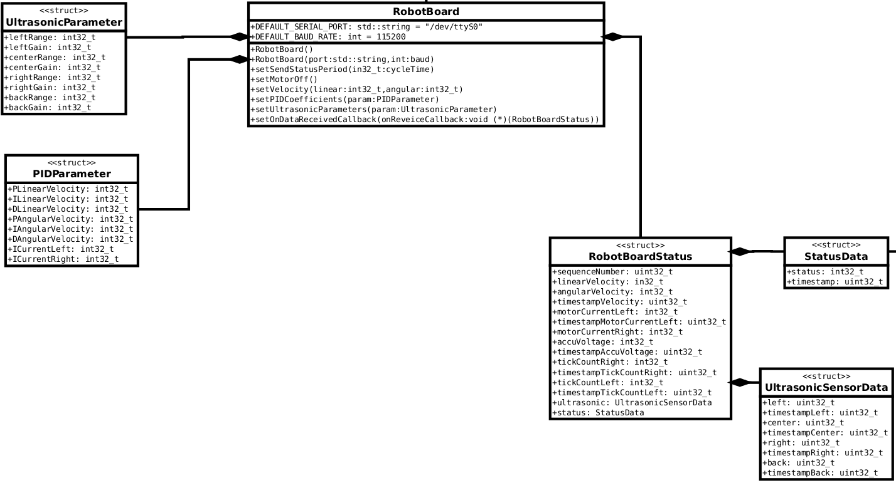

### UML diagram



### Example usage

```cpp
// RobotBoardDemo.cpp
#include <RobotBoard.h>

using namespace ifabot;

void dataReceivedCallback(RobotBoardStatus status){
  // Use received data here
}

void errorOccuredCallback(ErrorType type, std::string info){
  switch(type){
    case LOST_CONNECTION: 
        break;
    case LOST_PACKAGE: 
        // info tells which package it expected and which it received
        break;
    case UNDECODABLE_DATASTREAM: 
        // info contains the hexdump
        break;
  }
}

int main() {
  RobotBoard robot;

  robot.setOnDataReceivedCallback(dataReceivedCallback);
  robot.setOnErrorCallback(errorOccuredCallback);

  if(robot.connectAndStartReceiving()){
    // Connected
    robot.setVelocity(10,0);
    // ...
  }
}
```

Compile Example:

```Shell
g++ RobotBoardDemo.cpp -o RobotBoardDemo -lifabot -lboost_system -lboost_thread
```